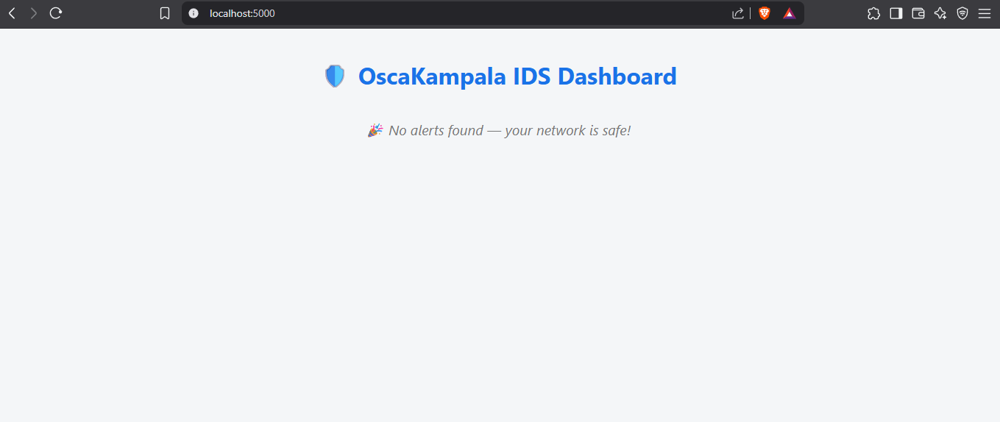

# 🚨 OscaKampala IDS

Welcome to **OscaKampala IDS** — a **real-time**, **Python-based** Intrusion Detection System designed to keep your network safe and sound!  
With a clean dashboard, customizable rules, and modular code, it’s built for **simplicity**, **power**, and **community contributions**.

---

## ✨ Features

- 🕵️‍♂️ Real-time packet capture & analysis  
- 📋 Customizable rule-based detection (YAML format)  
- ⚠️ Instant alerts & detailed logs  
- 🌐 Beautiful Flask dashboard for live monitoring  
- 🔧 Easy to extend & contribute to  
- 🛠️ Works on Linux & Windows (admin/root required)  

---

## 📂 Project Layout

<pre> OscaKampala-IDS/
│
├── core/
│   ├── capture.py         # Network packet capture logic
│   ├── rules.py           # Load & match detection rules
│   └── logger.py          # Alert logging functions
│
├── config/
│   └── rules.yaml         # Your detection signatures here
│
├── dashboard/
│   ├── app.py             # Flask dashboard app
│   └── templates/
│       └── index.html     # Dashboard frontend UI
│
├── logs/
│   └── alerts.log         # Generated alert logs
│
├── main.py                # IDS main program
├── requirements.txt       # Dependencies
└── README.md              # You are here 😉 </pre>


---

## 🚀 Quick Start

### Prerequisites

- `Python 3.8+`  
- `pip`  
- `Root/admin privileges for packet sniffing`  
- `Linux or Windows (with WinPcap/Npcap)`

---

### Setup

1. **Clone this repo**

    ```bash
    git clone https://github.com/osckampala/oscakampala-IDS.git
    cd OscaKampala-IDS
    ```

2. **Install dependencies**

    ```bash
    pip install -r requirements.txt
    ```

3. (Optional) Customize your detection rules in `config/rules.yaml`

---

### Usage

🔥 **Start the IDS:**

```bash
python main.py

👀 Open the dashboard in a new terminal:

cd dashboard
python app.py

Then open http://localhost:5000 in your browser to see live alerts!
🛠️ Customize Your Rules

Modify or add YAML rules in config/rules.yaml to detect your own suspicious patterns.
The format is simple and flexible — check existing rules to get started.
🤝 How to Contribute

We love contributions! Here’s how you can help:

    Fork & create a branch:

---
    git checkout -b feature/awesome-feature
    
    Write clean, well-documented code.

    Test your changes thoroughly.

    Open a pull request and describe your improvements.

📜 License

This project is licensed under the MIT License © OscaKampala.
📬 Contact Us

Questions? Suggestions? Reach out:
✉️ oscakampala.org
🌐 GitHub Profile

Thanks for checking out OscaKampala IDS!
Let’s secure networks — one packet at a time! 🚀🔒


---
## 🖼️ Screenshot



